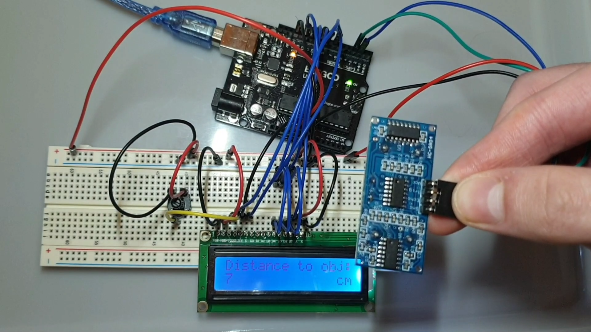

# ArduinoSensor
Reads in data using an HC-SR04 sensor and outputs the distance reading to an lcd display.

### How To Use
Change the following definitions:
- #define TRIG_PIN 2
- #define ECHO_PIN 3

within main.ino to the respective pins you're using for the trigger and echo pins, and
- #define BS_PIN 7
- #define E_PIN 8
- #define D4_PIN 9
- #define D5_PIN 10
- #define D6_PIN 11
- #define D7_PIN 12

within main.ino to the respective pins you're using for the lcd display.

